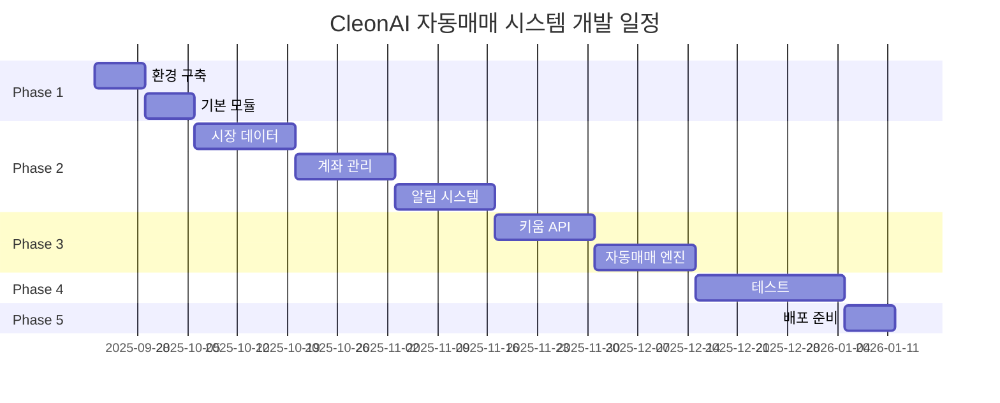

# 🗺️ CleonAI 자동매매 시스템 개발 로드맵

## 📋 프로젝트 개요

### 목표
Windows 기반 자동매매 시스템 개발 후 모바일 연동이 용이한 확장 가능한 아키텍처 구현

### 개발 기간
**총 16주 (약 4개월)**
- Phase 1: 기반 구축 (2주)
- Phase 2: 핵심 모듈 개발 (6주)  
- Phase 3: API 연동 및 자동매매 (4주)
- Phase 4: 테스트 및 최적화 (3주)
- Phase 5: 배포 및 문서화 (1주)

### 개발 리소스
- **개발자**: 1명 (풀타임)
- **예산**: 약 2,650만원 (3개월 개발비 + 인프라)
- **서버**: Windows Server 2022 + MongoDB + Redis + Node.js + Python

## 🚀 Phase 1: 기반 구축 (Week 1-2)

### Week 1: 개발 환경 구축

#### Day 1-2: 시스템 환경 설정
```powershell
# 개발 환경 체크리스트
□ Windows Server 2022 설치 및 설정
□ Node.js 18 LTS 설치
□ Python 3.11 설치 및 가상환경 구성
□ MongoDB Community 설치 및 설정
□ Redis 설치 및 서비스 등록
□ Git 설정 및 저장소 생성
□ VS Code 및 필수 확장프로그램 설치
□ 방화벽 및 보안 설정
```

**주요 작업:**
- [x] Windows Server 2022 기본 설정
- [x] 개발 도구 설치 및 환경 변수 설정
- [x] 데이터베이스 서버 구축
- [x] 네트워크 및 보안 설정

**검증 기준:**
- 모든 서비스가 정상 실행되는지 확인
- 포트 접근성 테스트 (3000, 27017, 6379)
- 기본 연결 테스트 완료

#### Day 3-4: 프로젝트 구조 생성
```bash
# 프로젝트 초기화
npm init -y
npm install express mongoose redis socket.io
npm install --save-dev jest supertest nodemon

# Python 환경
pip install PyQt5 pandas numpy schedule requests websockets
```

**주요 작업:**
- [x] 프로젝트 디렉토리 구조 생성
- [x] package.json 및 의존성 설정
- [x] 환경 설정 파일 (.env, config/) 구성
- [x] 기본 폴더 구조 및 템플릿 파일 생성

#### Day 5-7: 핵심 인프라 모듈 구현
**구현 대상:**
```javascript
// 핵심 인프라
core/
├── server.js          ✅ Express 서버 기본 구조
├── database.js        ✅ MongoDB/Redis 연결 관리
├── logger.js          ✅ Winston 기반 로깅 시스템
├── config.js          ✅ 설정 관리자
└── container.js       ✅ 의존성 주입 컨테이너
```

**검증 기준:**
- 서버가 정상적으로 시작되는지 확인
- 데이터베이스 연결 테스트 성공
- 로그 파일이 정상적으로 생성되는지 확인
- 헬스체크 엔드포인트 응답 확인

### Week 2: 데이터베이스 및 기본 모듈

#### Day 8-10: 데이터베이스 스키마 구현
**구현 대상:**
```javascript
database/
├── init_database.js     ✅ DB 초기화 스크립트
├── models/             
│   ├── user.js         ✅ 사용자 모델
│   ├── stock.js        ✅ 종목 모델  
│   ├── order.js        ✅ 주문 모델
│   ├── position.js     ✅ 포지션 모델
│   └── strategy.js     ✅ 전략 모델
└── migrations/         ✅ 마이그레이션 스크립트
```

**주요 작업:**
- MongoDB 컬렉션 및 인덱스 생성
- 초기 데이터 삽입 (관리자 계정, 주요 종목)
- 데이터 검증 및 제약 조건 설정
- 백업 및 복구 스크립트 작성

#### Day 11-14: 인증 모듈 구현
**구현 대상:**
```javascript
modules/auth/
├── index.js            ✅ 모듈 진입점
├── auth-controller.js  ✅ HTTP 컨트롤러
├── auth-service.js     ✅ 비즈니스 로직
├── auth-middleware.js  ✅ 인증 미들웨어
├── jwt-manager.js      ✅ JWT 토큰 관리
└── __tests__/         ✅ 단위 테스트
```

**주요 기능:**
- 사용자 로그인/로그아웃
- JWT 토큰 발급/검증/갱신
- 세션 관리 (Redis)
- 권한 기반 접근 제어
- 브루트포스 공격 방지

**API 엔드포인트:**
```http
POST /api/v1/auth/login      # 로그인
POST /api/v1/auth/logout     # 로그아웃  
POST /api/v1/auth/refresh    # 토큰 갱신
GET  /api/v1/auth/profile    # 프로필 조회
```

**검증 기준:**
- 모든 API 엔드포인트 정상 동작
- 단위 테스트 커버리지 90% 이상
- 보안 테스트 통과 (SQL Injection, XSS 등)

---

## ⚙️ Phase 2: 핵심 모듈 개발 (Week 3-8)

### Week 3-4: 시장 데이터 모듈

#### 주요 구현 사항
```javascript
modules/market/
├── data-collector.js       ✅ 실시간 데이터 수집
├── price-calculator.js     ✅ 가격 계산기
├── technical-analyzer.js   ✅ 기술적 지표 계산
├── websocket-server.js     ✅ 실시간 통신 서버
└── indicators/            
    ├── sma.js             ✅ 단순이동평균
    ├── ema.js             ✅ 지수이동평균
    ├── rsi.js             ✅ RSI
    ├── macd.js            ✅ MACD
    └── bollinger-bands.js ✅ 볼린저밴드
```

**핵심 기능:**
- 실시간 주가 데이터 수집 및 저장
- 기술적 지표 계산 (SMA, EMA, RSI, MACD, 볼린저밴드)
- WebSocket을 통한 실시간 데이터 전송
- 데이터 정규화 및 캐싱

**성능 목표:**
- 실시간 데이터 지연시간 < 500ms
- 동시 접속자 1,000명 지원
- 초당 100개 종목 처리

### Week 5-6: 계좌 관리 모듈

#### 주요 구현 사항
```javascript
modules/account/
├── account-controller.js   ✅ 계좌 API 컨트롤러
├── balance-service.js      ✅ 잔고 관리 서비스
├── position-manager.js     ✅ 포지션 관리자
├── portfolio-tracker.js    ✅ 포트폴리오 추적
└── risk-calculator.js      ✅ 리스크 계산기
```

**핵심 기능:**
- 계좌 잔고 실시간 조회
- 보유 포지션 관리
- 포트폴리오 성과 추적
- 리스크 지표 계산 (VaR, 샤프지수 등)

**API 엔드포인트:**
```http
GET  /api/v1/account/balance           # 잔고 조회
GET  /api/v1/account/positions         # 포지션 조회
GET  /api/v1/account/portfolio         # 포트폴리오 현황
GET  /api/v1/account/performance       # 성과 분석
POST /api/v1/account/risk-assessment   # 리스크 평가
```

### Week 7-8: 알림 및 유틸리티 모듈

#### 알림 모듈 구현
```javascript
modules/notification/
├── notification-service.js  ✅ 알림 서비스
├── email-sender.js          ✅ 이메일 발송
├── sms-sender.js            ✅ SMS 발송
├── push-sender.js           ✅ 푸시 알림
└── template-manager.js      ✅ 템플릿 관리
```

**알림 유형:**
- 주문 체결 알림
- 매매 신호 알림
- 리스크 경고 알림
- 일일/주간/월간 보고서

#### 유틸리티 모듈
```javascript
utils/
├── crypto.js              ✅ 암호화 유틸
├── validator.js           ✅ 검증 유틸
├── formatter.js           ✅ 포맷팅 유틸
├── error-handler.js       ✅ 에러 핸들러
└── metrics-collector.js   ✅ 메트릭 수집기
```

---

## 🔌 Phase 3: API 연동 및 자동매매 (Week 9-12)

### Week 9-10: 키움 API 연동

#### Python 기반 키움 API 구현
```python
kiwoom/
├── kiwoom_api.py           ✅ 키움 API 래퍼
├── kiwoom_bridge.py        ✅ Node.js 브리지
├── data_parser.py          ✅ 데이터 파서
├── order_manager.py        ✅ 주문 관리자
└── __tests__/              ✅ API 테스트
```

**주요 기능:**
- 키움 OpenAPI+ 연동
- 실시간 시세 수신
- 주문 처리 (매수/매도/정정/취소)
- 계좌 정보 조회
- 체결/잔고 데이터 처리

**검증 사항:**
```python
# API 연결 테스트
def test_kiwoom_connection():
    api = KiwoomAPI()
    assert api.login() == True
    assert len(api.get_account_list()) > 0

# 주문 테스트  
def test_order_processing():
    result = api.send_order('BUY', '005930', 1, 0)  # 시장가 매수
    assert result['success'] == True
    assert 'order_id' in result
```

### Week 11-12: 자동매매 엔진 핵심 구현

#### 매매 엔진 구현
```javascript
modules/trading/
├── trading-engine.js        ✅ 매매 엔진 핵심
├── strategy-manager.js      ✅ 전략 관리자
├── signal-generator.js      ✅ 신호 생성기
├── risk-manager.js          ✅ 리스크 관리자
├── order-processor.js       ✅ 주문 처리기
├── portfolio-manager.js     ✅ 포트폴리오 관리
└── performance-tracker.js   ✅ 성과 추적기
```

#### 매매 전략 구현
```javascript
strategies/
├── base-strategy.js         ✅ 기본 전략 클래스
├── sma-crossover.js         ✅ 이동평균 크로스오버
├── rsi-strategy.js          ✅ RSI 기반 전략
├── macd-strategy.js         ✅ MACD 전략
└── multi-strategy.js        ✅ 다중 전략 조합
```

**핵심 매매 로직:**
1. **신호 생성**: 기술적 지표 기반 매매 신호 생성
2. **리스크 검증**: 손실 한도, 포지션 크기 등 리스크 검증
3. **주문 처리**: 키움 API를 통한 실제 주문 전송
4. **포지션 관리**: 매수/매도 후 포지션 업데이트
5. **성과 추적**: 수익률, 승률 등 성과 지표 계산

**자동매매 API:**
```http
POST /api/v1/trading/start     # 자동매매 시작
POST /api/v1/trading/stop      # 자동매매 중지
GET  /api/v1/trading/status    # 매매 상태 조회
GET  /api/v1/trading/signals   # 매매 신호 조회
GET  /api/v1/trading/orders    # 주문 내역 조회
```

---

## 🧪 Phase 4: 테스트 및 최적화 (Week 13-15)

### Week 13: 통합 테스트

#### 테스트 시나리오
```javascript
// 자동매매 통합 테스트
describe('자동매매 통합 테스트', () => {
  test('전체 매매 프로세스', async () => {
    // 1. 사용자 로그인
    const loginResult = await authService.login(testUser.email, testUser.password);
    expect(loginResult.success).toBe(true);
    
    // 2. 자동매매 시작
    const tradingResult = await tradingEngine.startTrading(testUser.id, [strategyId]);
    expect(tradingResult.success).toBe(true);
    
    // 3. 시세 데이터 입력
    await marketData.updatePrice('005930', mockPriceData);
    
    // 4. 신호 생성 확인
    await waitForSignal();
    const signals = await signalGenerator.getSignals(testUser.id);
    expect(signals.length).toBeGreaterThan(0);
    
    // 5. 주문 처리 확인
    const orders = await orderProcessor.getOrders(testUser.id);
    expect(orders.some(order => order.status === 'FILLED')).toBe(true);
  });
});
```

#### 성능 테스트
```javascript
// 부하 테스트
const loadTest = {
  concurrent_users: 100,
  duration: '10m',
  scenarios: [
    'user_login',
    'start_trading', 
    'realtime_data',
    'signal_processing',
    'order_execution'
  ]
};
```

### Week 14: 보안 테스트

#### 보안 검증 항목
- [ ] SQL Injection 방어
- [ ] XSS 공격 방어  
- [ ] CSRF 토큰 검증
- [ ] API Rate Limiting
- [ ] 데이터 암호화 검증
- [ ] 세션 관리 보안
- [ ] 입력값 검증

#### 침투 테스트
```bash
# OWASP ZAP을 이용한 자동화된 보안 테스트
zap-baseline.py -t http://localhost:3000/api/v1/
zap-api-scan.py -t http://localhost:3000/openapi.json
```

### Week 15: 성능 최적화

#### 최적화 대상
1. **데이터베이스 쿼리 최적화**
   - 인덱스 최적화
   - 쿼리 실행 계획 분석
   - 집계 파이프라인 최적화

2. **캐시 전략 최적화**  
   - Redis 캐시 히트율 향상
   - 캐시 만료 정책 최적화
   - 분산 캐시 일관성 보장

3. **API 성능 최적화**
   - 응답 시간 < 200ms 목표
   - 동시 요청 처리 개선
   - 메모리 사용량 최적화

4. **실시간 처리 최적화**
   - WebSocket 연결 풀링
   - 이벤트 처리 배치화
   - 메시지 큐 도입

---

## 📦 Phase 5: 배포 및 문서화 (Week 16)

### Week 16: 운영 준비

#### Day 1-3: Windows 서비스 등록
```powershell
# PM2를 이용한 Windows 서비스 등록
pm2 start ecosystem.config.js
pm2 save
pm2-service-install -n "CleonAI-Trading"
```

**서비스 구성:**
- Node.js API 서버
- Python 키움 API 브리지  
- MongoDB 데이터베이스
- Redis 캐시 서버
- 로그 로테이션
- 자동 재시작 설정

#### Day 4-5: 모니터링 시스템 구축
```javascript
// 시스템 모니터링
const monitoring = {
  metrics: [
    'cpu_usage',
    'memory_usage', 
    'disk_usage',
    'network_traffic',
    'database_connections',
    'api_response_time',
    'trading_signals_per_minute',
    'order_success_rate'
  ],
  alerts: [
    'high_cpu_usage > 80%',
    'memory_usage > 85%',
    'api_errors > 10/min',
    'database_connection_failed'
  ]
};
```

#### Day 6-7: 문서화 완성

**문서 구성:**
```
docs/
├── README.md                    ✅ 프로젝트 개요
├── INSTALLATION.md             ✅ 설치 가이드
├── CONFIGURATION.md            ✅ 설정 가이드
├── API_DOCUMENTATION.md        ✅ API 문서
├── DEVELOPMENT_GUIDE.md        ✅ 개발 가이드
├── DEPLOYMENT_GUIDE.md         ✅ 배포 가이드
├── TROUBLESHOOTING.md          ✅ 문제 해결
├── SECURITY.md                 ✅ 보안 가이드
└── CHANGELOG.md                ✅ 변경 이력
```

**API 문서 예시:**
```yaml
# OpenAPI 3.0 스펙
openapi: 3.0.0
info:
  title: CleonAI Trading API
  version: 1.0.0
  description: 자동매매 시스템 API

paths:
  /api/v1/auth/login:
    post:
      summary: 사용자 로그인
      requestBody:
        required: true
        content:
          application/json:
            schema:
              type: object
              properties:
                email:
                  type: string
                  example: "user@example.com"
                password:
                  type: string
                  example: "password123"
      responses:
        200:
          description: 로그인 성공
          content:
            application/json:
              schema:
                type: object
                properties:
                  success:
                    type: boolean
                    example: true
                  user:
                    $ref: '#/components/schemas/User'
                  tokens:
                    $ref: '#/components/schemas/TokenPair'
```

---

## 📊 프로젝트 관리

### 일정 관리


### 위험 관리

#### 기술적 위험
| 위험 요소 | 발생 확률 | 영향도 | 대응 방안 |
|----------|----------|-------|----------|
| 키움 API 제한 | 중 | 높음 | 대체 API 검토, API 사용량 모니터링 |
| 성능 이슈 | 중 | 중 | 부하 테스트, 프로파일링 도구 활용 |
| 데이터 손실 | 낮음 | 높음 | 자동 백업, 복제 구성 |
| 보안 취약점 | 낮음 | 높음 | 보안 감사, 침투 테스트 |

#### 운영적 위험  
| 위험 요소 | 발생 확률 | 영향도 | 대응 방안 |
|----------|----------|-------|----------|
| 개발 지연 | 중 | 중 | 버퍼 시간 확보, 우선순위 조정 |
| 요구사항 변경 | 중 | 중 | 변경 관리 프로세스 수립 |
| 인력 부족 | 낮음 | 높음 | 외부 컨설팅, 교육 투자 |

### 품질 관리

#### 코드 품질 기준
```javascript
// ESLint + Prettier 설정
module.exports = {
  extends: ['eslint:recommended', '@typescript-eslint/recommended'],
  rules: {
    'complexity': ['error', 10],
    'max-lines-per-function': ['error', 50],
    'max-depth': ['error', 4],
    'no-console': 'warn'
  },
  plugins: ['security', 'sonarjs']
};
```

#### 테스트 커버리지 목표
- **단위 테스트**: 90% 이상
- **통합 테스트**: 80% 이상  
- **E2E 테스트**: 주요 시나리오 100%

### 성공 지표 (KPI)

#### 기술적 지표
- **시스템 가용성**: 99.9% 이상
- **API 응답 시간**: 평균 200ms 이하
- **실시간 데이터 지연**: 500ms 이하
- **주문 성공률**: 95% 이상

#### 비즈니스 지표  
- **사용자 만족도**: 4.5/5.0 이상
- **시스템 안정성**: 일평균 다운타임 < 5분
- **데이터 정확도**: 99.99% 이상
- **보안 사고**: 0건

---

## 🚀 향후 확장 계획

### 모바일 앱 개발 (Phase 6)
```
예상 일정: 8-12주 추가
기술 스택: Flutter + Dart
주요 기능:
- 실시간 대시보드
- 모바일 푸시 알림
- 터치 기반 차트 조작
- 생체 인증
```

### 고도화 기능 (Phase 7+)
- **AI/ML 기반 전략**: TensorFlow, scikit-learn
- **백테스팅 시스템**: 과거 데이터 기반 전략 검증
- **소셜 트레이딩**: 전략 공유 및 팔로우 기능
- **다중 브로커 지원**: 다른 증권사 API 추가
- **고빈도 매매**: 마이크로초 단위 최적화

### 기술 부채 관리
- **리팩토링 계획**: 매월 기술 부채 리뷰
- **성능 최적화**: 분기별 성능 튜닝
- **보안 업데이트**: 월별 보안 패치
- **의존성 관리**: 주간 의존성 업데이트

---

## 📞 연락처 및 지원

### 개발팀 연락처
- **프로젝트 매니저**: [PM 연락처]
- **기술 리드**: [Tech Lead 연락처]  
- **QA 담당자**: [QA 연락처]

### 지원 체계
- **개발 지원**: GitHub Issues, Slack 채널
- **사용자 지원**: 이메일, 전화 상담
- **긴급 대응**: 24/7 온콜 시스템

---

**문서 작성일**: 2025년 9월 22일  
**마지막 업데이트**: 2025년 9월 22일  
**버전**: 1.0.0  
**상태**: 개발 준비 완료 ✅

**다음 단계**: Phase 1 개발 환경 구축 시작 🚀

