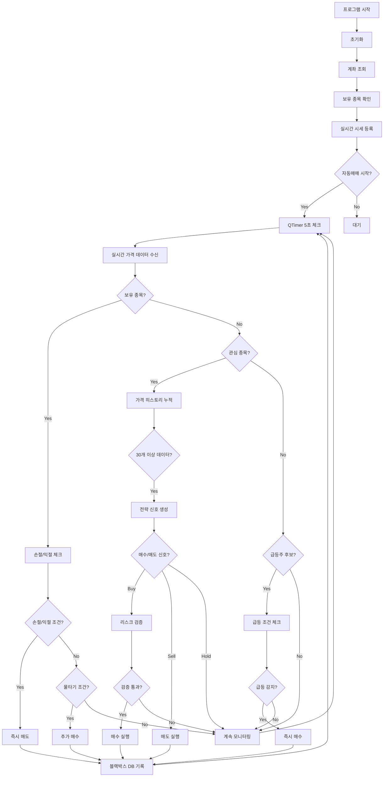

# 자동매매 시스템 매매 원리

> **작성일**: 2025-11-04  
> **버전**: 1.0  
> **대상**: CleonAI 자동매매 프로그램 사용자 및 개발자

## 📋 목차

1. [개요](#개요)
2. [매수 원리](#매수-원리)
3. [매도 원리](#매도-원리)
4. [리스크 관리](#리스크-관리)
5. [실행 흐름](#실행-흐름)
6. [설정값 영향도](#설정값-영향도)
7. [코드 위치](#코드-위치)

---

## 개요

CleonAI 자동매매 시스템은 **다중 전략 합의 알고리즘**과 **엄격한 리스크 관리**를 통해 안전하고 수익성 있는 자동매매를 구현합니다.

### 핵심 구성 요소

```
┌─────────────────────────────────────────────────────────┐
│                   자동매매 시스템                        │
├─────────────────────────────────────────────────────────┤
│                                                           │
│  ┌──────────────┐  ┌──────────────┐  ┌──────────────┐  │
│  │  전략 신호   │  │  급등주 감지 │  │ 리스크 관리  │  │
│  │  생성 엔진   │  │    시스템    │  │   시스템     │  │
│  └──────────────┘  └──────────────┘  └──────────────┘  │
│         │                  │                  │          │
│         └──────────────────┼──────────────────┘          │
│                            ↓                             │
│                   ┌──────────────┐                       │
│                   │  매매 실행   │                       │
│                   │    엔진      │                       │
│                   └──────────────┘                       │
│                            │                             │
│                            ↓                             │
│                   ┌──────────────┐                       │
│                   │  키움 API    │                       │
│                   └──────────────┘                       │
└─────────────────────────────────────────────────────────┘
```

### 매매 유형

시스템은 3가지 매매 방식을 지원합니다:

1. **전략 기반 매수/매도**: 기술적 분석 지표를 활용한 정석 매매
2. **급등주 자동 매수**: 시장에서 급등하는 종목을 실시간 감지하여 즉시 매수
3. **리스크 기반 매도**: 손절매/익절매를 통한 자동 포지션 정리

---

## 매수 원리

### 1. 일반 매수 (전략 기반)

#### 전략 시스템

시스템은 3가지 검증된 기술적 분석 전략을 사용합니다:

##### 1) 이동평균선 크로스오버 (MA Crossover)
- **골든크로스**: 단기 이평선(5일)이 장기 이평선(20일)을 상향 돌파
- **신호 강도**: 이평선 간 거리 비율 (0~5% → 0.0~1.0)
- **코드 위치**: `strategies.py` 77-143줄

```python
# 골든크로스 예시
단기 MA (5일): 75,000원
장기 MA (20일): 74,500원
→ 단기선이 장기선 위로 → 매수 신호
```

##### 2) RSI (Relative Strength Index)
- **과매도 구간 반등**: RSI < 30에서 상승 전환
- **신호 강도**: RSI 극단값 거리 (0~30 구간)
- **코드 위치**: `strategies.py` 145-200줄

```python
# RSI 과매도 반등 예시
이전 RSI: 28 (과매도)
현재 RSI: 32 (반등)
→ 매수 신호
```

##### 3) MACD (Moving Average Convergence Divergence)
- **상승 모멘텀**: MACD선이 시그널선을 상향 돌파
- **신호 강도**: 히스토그램 절대값 (±5 기준)
- **코드 위치**: `strategies.py` 202-261줄

```python
# MACD 골든크로스 예시
히스토그램: -0.5 → +0.8
→ 매수 신호
```

#### 합의 알고리즘

**다수결 원칙**: 3개 전략 중 **2개 이상 동의** 시 매수 실행

```
전략 A (MA): 매수 ✅
전략 B (RSI): 매수 ✅
전략 C (MACD): 관망 ⏸️
─────────────────────
최종 결정: 매수 실행! (2/3 동의)
```

#### 필수 조건

- ✅ **최소 데이터**: 30개 이상 가격 데이터 필요 (기술적 지표 계산용)
- ✅ **신호 강도**: `MIN_SIGNAL_STRENGTH` 이상 (기본값: 2)
- ✅ **리스크 검증**: 최대 보유 종목 수, 잔고, 일일 손실 한도 확인

#### 실행 과정

```
1. 실시간 가격 데이터 수신 (관심 종목)
   ↓
2. 가격 히스토리 누적 (최근 100개 유지)
   ↓
3. 30개 이상 데이터 확보 확인
   ↓
4. 각 전략별 신호 생성 (BUY/SELL/HOLD)
   ↓
5. 합의 알고리즘으로 최종 신호 결정
   ↓
6. 리스크 검증 (잔고, 최대 보유 종목 수 등)
   ↓
7. 매수 수량 계산 및 주문 실행
   ↓
8. 블랙박스 DB에 거래 기록
```

**코드 위치**: `trading_engine.py` 974-1203줄 (`execute_buy`)

---

### 2. 급등주 자동 매수

#### 동작 원리

실시간으로 시장을 스캔하여 **급등하는 종목을 자동으로 감지하고 즉시 매수**합니다.

#### 모니터링 대상

- **후보군**: 거래대금 상위 30개 종목 (설정 가능)
- **데이터 소스**: 키움 API `OPT10023` (거래량상위요청)
- **갱신 주기**: 실시간 (가격 변동 시마다)

#### 급등 감지 조건

급등주로 판단되려면 **모든 조건**을 만족해야 합니다:

##### 조건 1: 추가 상승률
```
모니터링 시작 시점 대비 추가 상승률 ≥ 5%

예시:
- 모니터링 시작: 전일 대비 +10%
- 현재 시점: 전일 대비 +15%
→ 추가 상승 5% → 조건 충족 ✅
```

**설정**: `SURGE_MONITORING_CHANGE_RATE` (기본값: 5.0%)

##### 조건 2: 거래량 급증
```
현재 거래량 / 평균 거래량 ≥ 2배

예시:
- 평균 거래량: 100만주
- 현재 거래량: 250만주
→ 비율 2.5배 → 조건 충족 ✅
```

**설정**: `SURGE_MIN_VOLUME_RATIO` (기본값: 2.0배)

##### 조건 3: 매수 압력 (선택적)
```
호가 데이터 기반 매수 압력 점수 ≥ 60점

점수 구성:
- 매수/매도 잔량 비율: 최대 40점
- 체결강도: 최대 40점
- 상승률: 최대 20점
```

**설정**: `SURGE_MIN_BUYING_PRESSURE` (기본값: 0.0, 비활성화)

#### 뉴스 점수 반영 (선택적)

뉴스 분석 활성화 시, **호재 뉴스가 있으면 급등 기준을 완화**합니다:

```
기본 급등 기준: 5%
뉴스 점수: +50 (호재)
→ 조정된 기준: 2.5% (50% 완화)
```

**설정**: `NEWS_POSITIVE_SURGE_ADJUST` (기본값: 50%)

#### 즉시 매수

급등주로 감지되면 **데이터 누적 대기 없이 즉시 매수** 실행:

```
급등 조건 충족
   ↓
승인 콜백 호출 (자동 승인 또는 수동 승인)
   ↓
즉시 매수 주문 (시장가)
   ↓
관심 종목에 추가 (지속 모니터링)
```

**신호 강도**: 3.0 (일반 매수보다 강력, 관심주는 4.0)

**코드 위치**: 
- 감지 로직: `surge_detector.py` 232-262줄 (`is_surge_detected`)
- 매수 실행: `trading_engine.py` 1566-1677줄 (`add_surge_stock`)

---

### 3. 물타기 (추가 매수)

#### 개념

보유 종목이 하락했을 때 **추가 매수하여 평균 매수가를 낮추는 전략**입니다.

#### 활성화 조건

기본적으로 **비활성화**되어 있으며, 설정으로 활성화해야 합니다:

```env
ENABLE_AVERAGE_DOWN=True
```

#### 추가 매수 조건

```
1. 현재 손실률이 트리거 기준 도달
   예: -2.5%, -5.0%, -7.5%, ...
   
2. 추가 매수 횟수가 최대 횟수 미만
   기본 최대: 2회

3. 잔고가 충분함
```

**설정**:
- `AVERAGE_DOWN_TRIGGER_PERCENT`: 2.5% (각 레벨마다 이 비율씩 하락 시 추가 매수)
- `MAX_AVERAGE_DOWN_COUNT`: 2회 (최대 추가 매수 횟수)

#### 수량 계산

```
추가 매수 수량 = 기존 수량 × 비율

예시:
- 최초 매수: 10주 @ 10,000원
- 손실률: -2.5% (9,750원)
→ 추가 매수: 10주 × 1.0 = 10주 @ 9,750원
→ 평균가: (10×10,000 + 10×9,750) / 20 = 9,875원
```

**설정**: `AVERAGE_DOWN_SIZE_RATIO` (기본값: 1.0배)

#### 평균가 재계산

추가 매수 후 자동으로 평균 매수가를 재계산하고, **손절/익절 기준도 평균가 기준으로 재설정**됩니다:

```python
평균가 = 총 투자금액 / 총 수량
손절가 = 평균가 × (1 - 5%)
익절가 = 평균가 × (1 + 10%)
```

#### 주의사항

⚠️ **물타기는 고위험 전략입니다**:
- 추가 하락 시 손실이 더욱 커질 수 있음
- 손절 기준에 더 빨리 도달할 수 있음
- 신중하게 활성화 여부 결정 필요

**코드 위치**: 
- 조건 체크: `risk_manager.py` 104-123줄 (`should_average_down`)
- 실행 로직: `trading_engine.py` 1286-1346줄 (`check_exit_conditions`)

---

## 매도 원리

### 1. 일반 매도 (전략 기반)

#### 신호 생성

매수와 동일한 3가지 전략이 **매도 신호**를 생성합니다:

- **이동평균선**: 데드크로스 (단기선 < 장기선)
- **RSI**: 과매수 구간(>70) 하락
- **MACD**: 히스토그램 음전환

#### 합의 알고리즘

```
전략 A (MA): 매도 ✅
전략 B (RSI): 매도 ✅
전략 C (MACD): 관망 ⏸️
─────────────────────
최종 결정: 매도 실행! (2/3 동의)
```

#### 매도 금지 기능

사용자가 **수동으로 매도를 차단**할 수 있습니다:

```python
position.sell_blocked = True  # GUI에서 설정 가능
```

매도 금지 설정 시:
- ✅ 일반 매도 신호 무시
- ❌ 손절매/익절매는 **여전히 실행** (안전장치)

**코드 위치**: `trading_engine.py` 1204-1285줄 (`execute_sell`)

---

### 2. 손절매 (자동, 최우선)

#### 개념

**손실을 제한**하기 위해 평균 매수가 대비 일정 비율 이상 하락 시 자동 매도합니다.

#### 기본 기준

```
손절가 = 평균 매수가 × (1 - 5%)

예시:
- 평균 매수가: 10,000원
- 손절가: 9,500원
→ 현재가 9,500원 이하 시 자동 매도
```

**설정**: `STOP_LOSS_PERCENT` (기본값: 5.0%)

#### 뉴스 점수 반영 (선택적)

뉴스 분석 활성화 시, **악재 뉴스가 있으면 손절 기준을 강화**(더 빨리 손절):

```
기본 손절 기준: -5%
뉴스 점수: -50 (악재)
→ 조정된 기준: -2.5% (50% 강화)
```

**설정**: `NEWS_NEGATIVE_STOPLOSS_ADJUST` (기본값: 50%)

#### 실행 우선순위

손절매는 **최우선 주문**으로 처리됩니다:

```python
order_result = self.kiwoom.sell_order(
    stock_code,
    quantity,
    0,  # 시장가
    priority="손절"  # 최우선
)
```

#### 체크 주기

- **보유 종목**: 5초마다 체크
- **리스크 관리**: `check_exit_conditions()`에서 최우선 실행

**코드 위치**: 
- 조건 체크: `risk_manager.py` 267-284줄 (`check_stop_loss`)
- 실행 로직: `trading_engine.py` 1390-1513줄 (`execute_exit`)

---

### 3. 익절매 (자동)

#### 개념

**수익을 확정**하기 위해 평균 매수가 대비 일정 비율 이상 상승 시 자동 매도합니다.

#### 기준

```
익절가 = 평균 매수가 × (1 + 10%)

예시:
- 평균 매수가: 10,000원
- 익절가: 11,000원
→ 현재가 11,000원 이상 시 자동 매도
```

**설정**: `TAKE_PROFIT_PERCENT` (기본값: 10.0%)

#### 실행 우선순위

익절매도 **우선 주문**으로 처리됩니다:

```python
order_result = self.kiwoom.sell_order(
    stock_code,
    quantity,
    0,  # 시장가
    priority="익절"  # 우선
)
```

#### 체크 주기

- **보유 종목**: 5초마다 체크
- 손절매 체크 후, 익절매 체크 순서

**코드 위치**: 
- 조건 체크: `risk_manager.py` 286-303줄 (`check_take_profit`)
- 실행 로직: `trading_engine.py` 1390-1513줄 (`execute_exit`)

---

## 리스크 관리

### 1. 포지션 크기 제한

#### 2단계 비율 시스템

```
1단계: 전체 잔고의 80%를 자동매매에 사용
       → 자동매매 잔고

2단계: 자동매매 잔고의 10%를 각 종목에 투자
       → 종목당 투자금

예시:
- 총 잔고: 10,000,000원
- 자동매매 잔고: 8,000,000원 (80%)
- 종목당 투자금: 800,000원 (10%)
```

**설정**:
- `AUTO_TRADING_RATIO`: 80% (자동매매 사용 비율)
- `POSITION_SIZE_PERCENT`: 10% (종목당 비율)

#### 매수 수량 계산

```python
available_cash = 총잔고 × (AUTO_TRADING_RATIO/100) × (POSITION_SIZE_PERCENT/100)
quantity = available_cash / 현재가
```

**코드 위치**: `risk_manager.py` 366-399줄 (`calculate_position_size`)

---

### 2. 최대 보유 종목 수

```
최대 동시 보유: 3종목 (기본값)

→ 3개 종목 보유 중이면 신규 매수 불가
→ 분산 투자 강제
```

**설정**: `MAX_STOCKS` (기본값: 3)

**검증 로직**: 
```python
if len(positions) >= MAX_STOCKS:
    return False, "최대 보유 종목 수 초과"
```

**코드 위치**: `risk_manager.py` 434-490줄 (`validate_new_position`)

---

### 3. 일일 손실 한도

#### 계산 방식

```
시작 자금 대비 총 손실률 ≥ 3% 시 신규 매수 중지

계산:
- 시작 총 자산 = 시작 잔고 + 보유 종목 평가액
- 현재 총 자산 = 현재 잔고 + 보유 종목 평가액
- 일일 손실률 = (시작 - 현재) / 시작 × 100

예시:
- 시작: 10,000,000원
- 현재: 9,700,000원
→ 손실률: 3% → 신규 매수 중지 ⛔
```

**설정**: `DAILY_LOSS_LIMIT_PERCENT` (기본값: 3.0%)

#### 동작

- ✅ 신규 매수 차단
- ✅ 보유 종목은 계속 모니터링 (손절/익절 작동)
- ✅ 다음 거래일 자동 리셋

**코드 위치**: `risk_manager.py` 400-433줄 (`check_daily_loss_limit`)

---

### 4. 수수료 고려

#### 수수료 체계

**모의투자**:
```
매수 수수료: 0.015%
매도 수수료: 0.315% (거래세 0.23% + 수수료 0.085%)
```

**실계좌**: 증권사별로 다름 (설정 가능)

#### 손익 계산

시스템은 **수수료를 자동으로 차감**하여 실제 순손익을 계산합니다:

```
명목 손익 = (매도가 - 매수가) × 수량
실제 순손익 = 명목 손익 - 매수 수수료 - 매도 수수료

예시:
- 매수: 10주 @ 10,000원 (수수료 15원)
- 매도: 10주 @ 11,000원 (수수료 347원)
- 명목 손익: +10,000원
- 순손익: +9,638원 (수수료 362원 차감)
```

#### 손익분기점

수수료를 고려한 손익분기점을 자동 계산합니다:

```python
fee_info = fee_calculator.get_fee_info(price, quantity)
# {
#   'break_even_price': 10,036원,
#   'break_even_rate': +0.36%
# }
```

**코드 위치**: `fee_calculator.py` (전체)

---

## 실행 흐름

### 전체 프로세스



### 상세 단계

#### 1. 프로그램 시작 및 초기화

```
main.py 실행
    ↓
PyQt 애플리케이션 생성
    ↓
키움 API 초기화 및 로그인
    ↓
TradingEngine 생성 및 초기화
    │
    ├─ 계좌 정보 조회 (잔고, 보유 종목)
    ├─ RiskManager에 잔고 설정
    ├─ 보유 종목 포지션 등록
    ├─ 실시간 시세 등록 (관심 종목 + 보유 종목)
    ├─ 급등주 감지기 초기화 (선택적)
    └─ 각종 콜백 설정
    ↓
MonitorWindow GUI 생성 및 표시
    ↓
사용자가 "자동매매 시작" 버튼 클릭 대기
```

#### 2. 자동매매 시작

```
"자동매매 시작" 버튼 클릭
    ↓
시장 상태 확인
    ↓
QTimer 시작 (5초 간격)
    ↓
급등주 모니터링 시작 (선택적)
    ↓
실시간 데이터 수신 대기
```

#### 3. 실시간 모니터링 (QTimer 5초마다)

```
_periodic_check() 호출
    │
    ├─ 시장 상태 확인 (개발 모드가 아닌 경우)
    ├─ 하트비트 (1분마다)
    ├─ 상태 요약 (5분마다)
    ├─ 보유 종목 현재가 업데이트 (1분마다)
    ├─ check_exit_conditions() → 손절/익절/물타기
    └─ check_daily_loss_limit() → 일일 손실 한도
```

#### 4. 실시간 가격 데이터 수신

```
on_price_update() 콜백 호출 (가격 변동 시마다)
    │
    ├─ 급등주 감지기에 데이터 전달
    ├─ 관심 종목이 아니면 종료
    ├─ 가격 히스토리 업데이트
    ├─ 보유 종목 현재가 업데이트
    ├─ 30개 이상 데이터 확인
    └─ process_signal() → 전략 신호 생성
```

#### 5. 매수/매도 실행

```
전략 신호 BUY
    ↓
execute_buy()
    │
    ├─ 리스크 검증 (validate_new_position)
    ├─ 수량 계산 (calculate_position_size)
    ├─ 키움 API 매수 주문 (buy_order)
    ├─ 포지션 추가 (add_position)
    ├─ 블랙박스 DB 기록 (record_trade, start_position)
    └─ 실시간 시세 등록
    
전략 신호 SELL
    ↓
execute_sell()
    │
    ├─ 매도 금지 확인
    ├─ 키움 API 매도 주문 (sell_order)
    ├─ 포지션 제거 (remove_position)
    └─ 블랙박스 DB 기록 (record_trade, close_position)
    
손절/익절 조건
    ↓
execute_exit()
    │
    ├─ 키움 API 매도 주문 (우선순위 "손절"/"익절")
    ├─ 포지션 제거
    └─ 블랙박스 DB 기록
```

#### 6. 급등주 감지 및 매수

```
급등주 후보 실시간 모니터링
    ↓
is_surge_detected() 조건 체크
    ↓
on_surge_detected() 콜백 호출
    ↓
승인 요청 (자동 또는 수동)
    ↓
add_surge_stock()
    │
    ├─ 관심 종목에 추가
    ├─ execute_buy() 즉시 호출
    └─ 블랙박스 DB 기록
```

---

## 설정값 영향도

### 주요 설정값 요약

| 설정 | 기본값 | 범위 | 영향 |
|-----|-------|------|------|
| **매매 전략** ||||
| `MIN_SIGNAL_STRENGTH` | 2 | 1-3 | ↑ 높을수록 보수적 (더 많은 전략 동의 필요) |
| `MA_SHORT_PERIOD` | 5 | 3-20 | ↑ 높을수록 느린 반응 |
| `MA_LONG_PERIOD` | 20 | 10-50 | ↑ 높을수록 느린 반응 |
| `RSI_PERIOD` | 14 | 7-21 | ↑ 높을수록 완만한 곡선 |
| `RSI_OVERSOLD` | 30 | 20-40 | ↓ 낮을수록 엄격한 과매도 판단 |
| `RSI_OVERBOUGHT` | 70 | 60-80 | ↑ 높을수록 엄격한 과매수 판단 |
| **리스크 관리** ||||
| `STOP_LOSS_PERCENT` | 5% | 3-10% | ↓ 낮을수록 빠른 손절 (안전) |
| `TAKE_PROFIT_PERCENT` | 10% | 5-20% | ↑ 높을수록 긴 보유 기간 |
| `DAILY_LOSS_LIMIT_PERCENT` | 3% | 1-5% | ↓ 낮을수록 보수적 |
| `MAX_STOCKS` | 3 | 1-10 | ↑ 높을수록 분산투자 |
| `AUTO_TRADING_RATIO` | 80% | 50-100% | 자동매매에 사용할 잔고 비율 |
| `POSITION_SIZE_PERCENT` | 10% | 5-33% | 종목당 투자 비율 |
| **급등주 감지** ||||
| `SURGE_CANDIDATE_COUNT` | 30 | 10-100 | ↑ 높을수록 더 많은 종목 모니터링 (부하↑) |
| `SURGE_MONITORING_CHANGE_RATE` | 5% | 3-10% | ↑ 높을수록 엄격한 급등 판단 |
| `SURGE_MIN_VOLUME_RATIO` | 2.0배 | 1.5-5.0배 | ↑ 높을수록 엄격한 거래량 판단 |
| `SURGE_COOLDOWN_MINUTES` | 30분 | 10-120분 | 중복 감지 방지 시간 |
| **물타기 (추가 매수)** ||||
| `ENABLE_AVERAGE_DOWN` | False | True/False | 물타기 활성화 여부 |
| `AVERAGE_DOWN_TRIGGER_PERCENT` | 2.5% | 1-5% | 추가 매수 트리거 (손실률) |
| `MAX_AVERAGE_DOWN_COUNT` | 2회 | 1-5회 | 최대 추가 매수 횟수 |
| `AVERAGE_DOWN_SIZE_RATIO` | 1.0배 | 0.5-2.0배 | 추가 매수 수량 비율 |
| **뉴스 분석** ||||
| `ENABLE_NEWS_ANALYSIS` | False | True/False | 뉴스 기반 조정 활성화 |
| `NEWS_POSITIVE_SURGE_ADJUST` | 50% | 0-100% | 호재 시 급등 기준 완화 비율 |
| `NEWS_NEGATIVE_STOPLOSS_ADJUST` | 50% | 0-100% | 악재 시 손절 기준 강화 비율 |

### 추천 설정 프로파일

#### 보수적 (안전 우선)

```env
MIN_SIGNAL_STRENGTH=3           # 3개 전략 모두 동의
STOP_LOSS_PERCENT=3             # 빠른 손절
TAKE_PROFIT_PERCENT=7           # 적당한 익절
MAX_STOCKS=2                    # 집중 투자
SURGE_MONITORING_CHANGE_RATE=7  # 엄격한 급등 기준
ENABLE_AVERAGE_DOWN=False       # 물타기 비활성화
```

#### 표준 (균형)

```env
MIN_SIGNAL_STRENGTH=2           # 기본값 (현재 설정)
STOP_LOSS_PERCENT=5
TAKE_PROFIT_PERCENT=10
MAX_STOCKS=3
SURGE_MONITORING_CHANGE_RATE=5
ENABLE_AVERAGE_DOWN=False
```

#### 공격적 (수익 우선)

```env
MIN_SIGNAL_STRENGTH=2           # 2개 전략 동의
STOP_LOSS_PERCENT=7             # 느린 손절
TAKE_PROFIT_PERCENT=15          # 긴 보유
MAX_STOCKS=5                    # 분산 투자
SURGE_MONITORING_CHANGE_RATE=3  # 완화된 급등 기준
ENABLE_AVERAGE_DOWN=True        # 물타기 활성화
AVERAGE_DOWN_TRIGGER_PERCENT=2.5
MAX_AVERAGE_DOWN_COUNT=2
```

⚠️ **주의**: 공격적 설정은 **높은 리스크**를 수반합니다. 충분한 테스트 후 사용하세요.

---

## 코드 위치

### 핵심 모듈

| 모듈 | 파일 | 주요 기능 |
|-----|------|----------|
| **자동매매 엔진** | `trading_engine.py` | 전체 매매 프로세스 통합 관리 |
| **매매 전략** | `strategies.py` | 기술적 분석 신호 생성 |
| **리스크 관리** | `risk_manager.py` | 포지션 관리, 손절/익절, 일일 한도 |
| **기술적 지표** | `indicators.py` | SMA, RSI, MACD 계산 |
| **키움 API** | `kiwoom_api.py` | 키움 Open API 래퍼 |
| **급등주 감지** | `surge_detector.py` | 급등주 실시간 모니터링 |
| **설정 관리** | `config.py` | 모든 설정값 로드 및 검증 |

### 주요 함수 위치

#### trading_engine.py

| 함수 | 줄 번호 | 설명 |
|-----|--------|------|
| `initialize()` | 204-428 | 엔진 초기화 |
| `start_trading()` | 470-552 | 자동매매 시작 |
| `_periodic_check()` | 553-644 | 주기적 체크 (QTimer) |
| `on_price_update()` | 820-898 | 실시간 가격 데이터 처리 |
| `process_signal()` | 899-950 | 매매 신호 처리 |
| `execute_buy()` | 974-1203 | 매수 실행 |
| `execute_sell()` | 1204-1285 | 매도 실행 |
| `check_exit_conditions()` | 1286-1388 | 손절/익절/물타기 체크 |
| `execute_exit()` | 1390-1513 | 강제 청산 실행 |
| `on_surge_detected()` | 1514-1565 | 급등주 감지 콜백 |
| `add_surge_stock()` | 1566-1677 | 급등주 매수 실행 |

#### strategies.py

| 클래스/함수 | 줄 번호 | 설명 |
|----------|--------|------|
| `MACrossoverStrategy` | 77-143 | 이동평균선 크로스오버 전략 |
| `RSIStrategy` | 145-200 | RSI 전략 |
| `MACDStrategy` | 202-261 | MACD 전략 |
| `MultiStrategy` | 263-368 | 통합 전략 (합의 알고리즘) |
| `create_default_strategies()` | 371-389 | 기본 전략 세트 생성 |

#### risk_manager.py

| 클래스/함수 | 줄 번호 | 설명 |
|----------|--------|------|
| `Position` | 42-184 | 포지션 정보 클래스 |
| `should_average_down()` | 104-123 | 추가 매수 조건 확인 |
| `is_stop_loss_triggered()` | 167-171 | 손절매 조건 확인 |
| `is_take_profit_triggered()` | 173-175 | 익절매 조건 확인 |
| `RiskManager` | 211-724 | 리스크 관리 클래스 |
| `check_stop_loss()` | 267-284 | 손절매 체크 |
| `check_take_profit()` | 286-303 | 익절매 체크 |
| `check_average_down()` | 305-326 | 추가 매수 체크 |
| `calculate_position_size()` | 366-399 | 매수 수량 계산 |
| `check_daily_loss_limit()` | 400-433 | 일일 손실 한도 체크 |
| `validate_new_position()` | 434-490 | 신규 포지션 검증 |
| `add_position()` | 491-550 | 포지션 추가 |
| `remove_position()` | 551-625 | 포지션 제거 |

#### surge_detector.py

| 클래스/함수 | 줄 번호 | 설명 |
|----------|--------|------|
| `SurgeCandidate` | 34-291 | 급등주 후보 정보 |
| `is_surge_detected()` | 227-262 | 급등 조건 확인 |
| `SurgeDetector` | 293-end | 급등주 감지 클래스 |
| `initialize()` | 358-469 | 급등주 감지기 초기화 |
| `start_monitoring()` | 471-500 | 실시간 모니터링 시작 |

#### indicators.py

| 함수 | 줄 번호 | 설명 |
|-----|--------|------|
| `calculate_sma()` | 30-44 | 단순 이동평균 |
| `calculate_ema()` | 47-69 | 지수 이동평균 |
| `calculate_rsi()` | 72-105 | RSI 계산 |
| `calculate_macd()` | 108-158 | MACD 계산 |
| `calculate_bollinger_bands()` | 161-190 | 볼린저 밴드 |
| `calculate_all_indicators()` | 193-237 | 모든 지표 일괄 계산 |

---

## 부록

### 용어 정리

- **골든크로스**: 단기 이동평균선이 장기 이동평균선을 상향 돌파하는 현상 (매수 신호)
- **데드크로스**: 단기 이동평균선이 장기 이동평균선을 하향 돌파하는 현상 (매도 신호)
- **RSI**: 0~100 범위의 모멘텀 지표, 30 이하는 과매도, 70 이상은 과매수
- **MACD**: 두 이동평균선의 차이를 이용한 추세 추종 지표
- **손절매**: 손실을 제한하기 위한 자동 매도
- **익절매**: 수익을 확정하기 위한 자동 매도
- **물타기**: 하락 시 추가 매수하여 평균 단가를 낮추는 전략
- **포지션**: 보유 중인 종목의 매수 정보 (수량, 평균가 등)
- **블랙박스**: 모든 거래 내역과 시장 상황을 기록하는 데이터베이스

### 관련 문서

- [빠른 시작 가이드](QUICKSTART.md)
- [매매 전략 가이드](STRATEGY_GUIDE.md)
- [설정 가이드](../installation/ENV_TEMPLATE.md)
- [문제 해결](../troubleshooting/TROUBLESHOOTING.md)

### 문의 및 지원

문제가 발생하거나 궁금한 점이 있으면:
1. [FAQ](../troubleshooting/FAQ.md) 확인
2. [문제 해결 가이드](../troubleshooting/TROUBLESHOOTING.md) 참고
3. GitHub Issues에 문의

---

**문서 버전**: 1.0  
**최종 업데이트**: 2025-11-04  
**작성자**: CleonAI 개발팀

